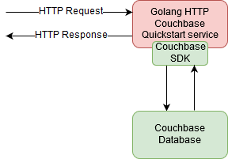

## Collaborators
Component Owner: Name1<br>
Solution Architect: Name1<br>
Product Owner: Name1<br>
Developers: Name1, Name2<br>
Reviewers: Name1, Name2<br>

## Design diagram

<table><tr><td>
    
</td></tr></table>

## API Specification

## Insert an Item

### HTTP Request

#### HTTP Method:
PUT

#### URL:
http(s)://server:port/foo/

#### HTTP Request Headers:

<table>
    <tr>
        <td>Name</td>
        <td>Type</td>
        <td>Required / Optional</td>
        <td>Description</td>
    </tr>
    <tr>
        <td>Authorization</td>
        <td>String</td>
        <td>Required</td>
        <td>Bearer Access Token returned by IAM.</td>
    </tr>
    <tr>
        <td>X-Authorization</td>
        <td>String</td>
        <td>Required</td>
        <td>OpenVideoAccessToken that contains the user ID.</td>
    </tr>
 </table>

#### HTTP Request Body:

<table>
    <tr>
        <td>Name</td>
        <td>Type</td>
        <td>Description</td>
    </tr>
    <tr>
        <td>attr2</td>
        <td>String</td>
        <td>Unique identifier of the item.</td>
    </tr>
 </table>

#### Request Syntax Example:

````
PUT http(s)://server/foo/
{
    "attr2": "123"
}
````

### HTTP Response

#### HTTP Response Headers:

<table>
    <tr>
        <td>Name</td>
        <td>Type</td>
        <td>Description</td>
    </tr>
    <tr>
        <td>Content-Type</td>
        <td>String</td>
        <td>application/json</td>
    </tr>
 </table>

#### HTTP Response Body:

<table>
    <tr>
        <td>Name</td>
        <td>Type</td>
        <td>Description</td>
    </tr>
    <tr>
        <td>Success or Failure acknowledgement</td>
        <td>JSON</td>
        <td>JSON payload</td>
    </tr>
 </table>

#### HTTP Response Codes:

<table>
    <tr>
        <td>HTTP Status Code</td>
        <td>Description</td>
    </tr>
    <tr>
        <td>200</td>
        <td>
        Success (0) scenarios:<br>
        Item successfully added<br><br>
        Failure (-1) scenarios:<br>
        40101 - Invalid request parameter - attr1<br>
        40102 - Invalid request parameter - attr2<br>
        40103 - Subsystem failure<br>
        40104 - Unknown failure
        </td>
    </tr>
    <tr>
        <td>400</td>
        <td>
        Bad Request. Request JSON body is missing or not parseable
        </td>
    </tr>
    <tr>
        <td>401</td>
        <td>
        Unauthorized. API Authentication Failed. The access token specified is invalid.
        </td>
    </tr>
    <tr>
        <td>403</td>
        <td>
        Forbidden. The valid client/user is not authorized to perform this operation
        </td>
    </tr>
 </table>

#### Response Syntax Example:

The following response is an example of successful insert:

````
{
  "header": {
    "source": "MW-Foo-HTTP-01",
    "code": "0",
    "message": "Success",
    "system_time": 1558041284123
  }
}
````

The following response is an example of failure insert due to invalid or missing OVAT:

````
{
  "header": {
    "source": "MW-FOO-HTTP-01",
    "code": "-1",
    "message": "Failure",
    "system_time": 1558041284123,
    "errors": [
      {
        "code": "40101",
        "description": "Invalid request parameter - Attr1"
      }
    ]
  }
}
````
